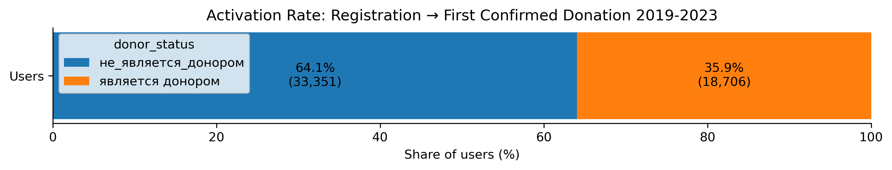
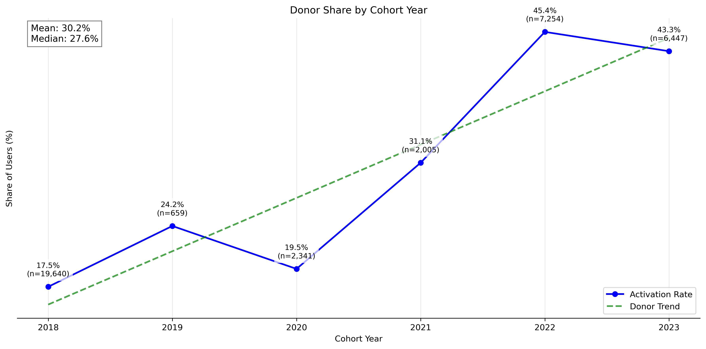
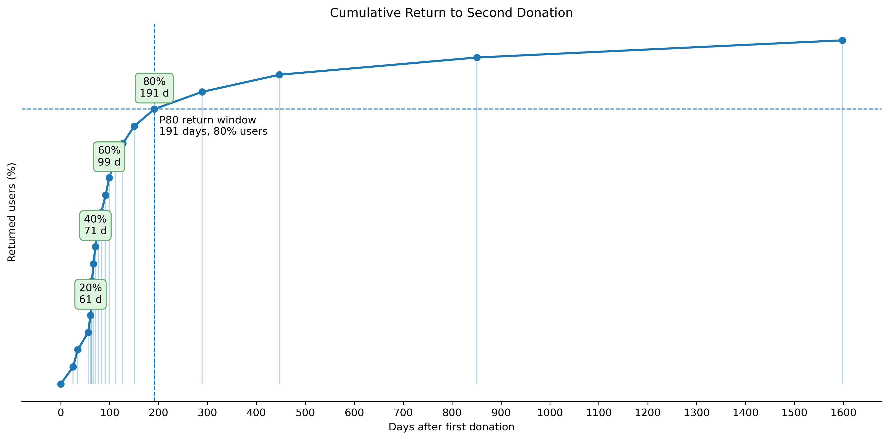
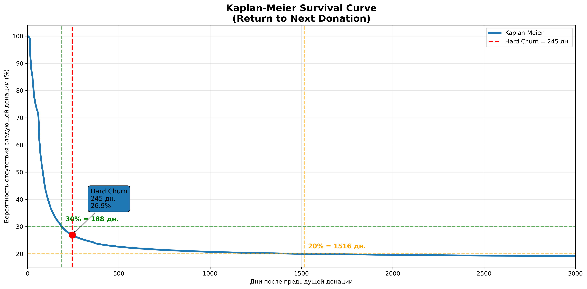
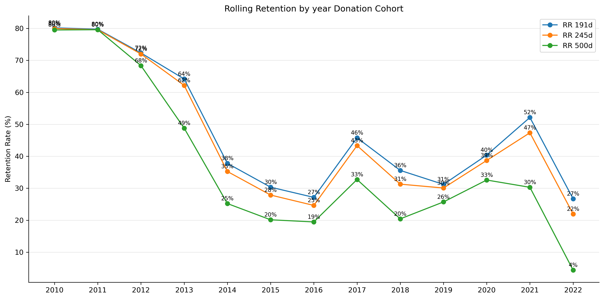
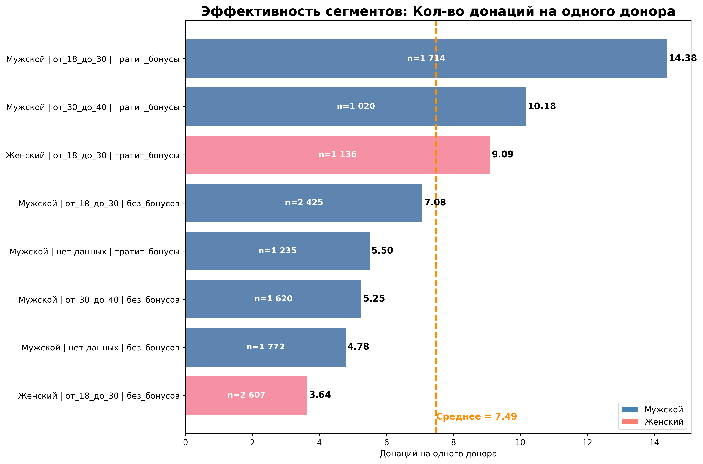
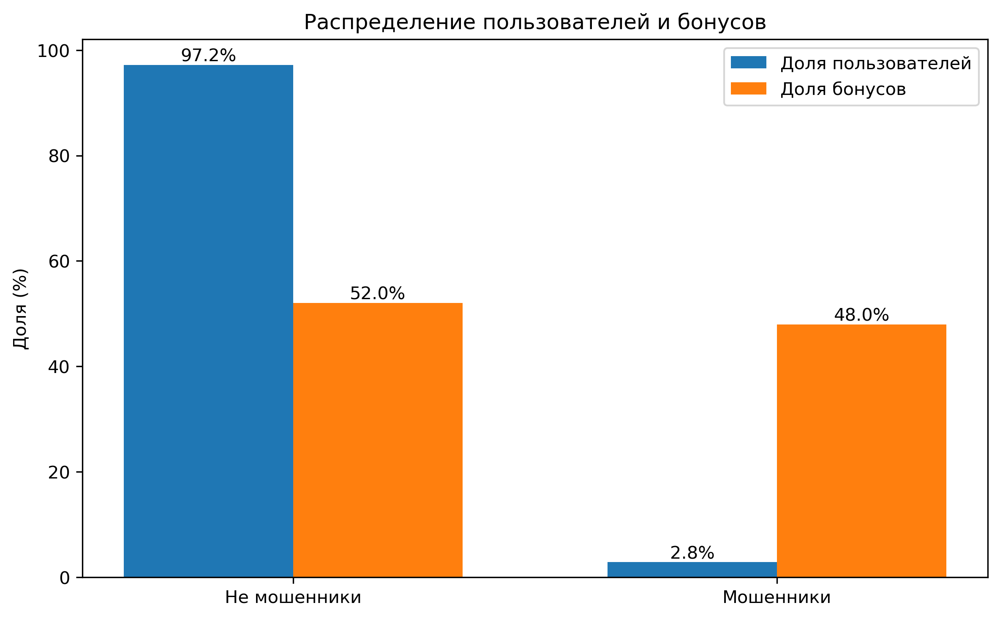

# **проект: Donor Search - Проект посвящен исследованию активности доноров крови и факторов,влияющих на повторные донации.**

 <!-- желательно добавить обложку -->

## Автор: 
**Saymon_XYZ**
[GitHub](https://github.com/rocketsaymon-x)

## **Цель:  исследовать жизненный цикл доноров и определить факторы, влияющие на:**

- первую донацию (Activation);

- повторные донации (Retention);

- долгосрочную активность доноров.

Основная бизнес-задача:

- увеличить количество повторных донаций и повысить стабильность донорского запаса крови.

## Бизнес-контекст:

- Для медицинских учреждений критически важно поддерживать стабильный запас крови и её компонентов.

- Основная проблема заключается не только в привлечении новых доноров, но и в сохранении их активности после первой донации.

## Таблицы данных:

* user\_anon\_data- Содержит данные о пользователях в системе;
* Таблица donation\_anon - Содержит информацию о донациях пользователей;
* Таблица donation\_plan - Содержит информацию о планировании донаций;
* Таблица user\_anon\_bonus - Содержит информацию о бонусах для доноров;
* Таблица user\_donation - Содержит информацию о пользователях, которые присоединялись к мероприятиям;
* Таблица events - Содержит информацию о мероприятиях.

# Стек проекта

## База данных: PostgreSQL
## Python: pandas, numpy, matplotlib, seaborn, pathlib, KaplanMeierFitter, KneeLocator
## Визуализация и анализ: Jupyter Notebook, DataLens, from matplotlib.patches import Patch
## Инструменты: Git, GitHub, DBeaver, Jupyter Notebook

---
donorsearch-analytics/

├── README.md
├── requirements.txt
│
├── sql/        # Все ad-hoc и подготовка данных
│   ├── 01_prepare_data.sql
│   ├── 02_activation.sql
│   ├── 03_churn.sql
│   ├── 04_ltv.sql
│   ├── 05_bonus_analysis.sql
│
├── notebooks/ # EDA и анализ
│   ├── 01_data_quality.ipynb
│   ├── 02_activation_analysis.ipynb
│   ├── 03_retention_analysis.ipynb
│   ├── 04_bonus_analysis.ipynb
│   ├── 05_segmentation_analysis.ipynb
│
└── images/  # Все графики

---

## Основные аналитические задачи

### ad_hoc SQL:

- определить топ города по количеству доноров;

- сегментировать доноров: гендер/возраст/бонус;

- определить топ 7 групп с самой большой долей донацией от общего числа;

- Анализ first-time churn: определить АНТИТОП 10 станций с самым высоким churn;

- Расчёт donation-based LTV по когортам за 2019 год;

- Анализ сезонности донаций, определить месяца с самой высокой и низкой активностью за 2019-2020 год;

- Поиск аномалий в бонусной системе, есть ли пользователи, которые получают больше бонусов, чем делают донации;

- Сегментация доноров по: гендерам/городам/возрасту (исключить до 18 и старше 70)/бонус за донат. Подготовка данных для EDA в Python;

### EDA Python:

- Activation_rate изучить от чего зависит;

- Как ведут себя доноры после второй донации, определить Churn Threshold и построить Rolling Retention;

- Изучить начисления бонусов пользователям, кто стремится получать больше всех, а кто делает донации без пользователей;

- Сегментировать пользователей, выявить основные группы, которые делают 80% донаций.

### Используемые аналитические подходы

- Cohort Analysis

- Retention Analysis

- Churn Analysis

- Donor Value Analysis

- анализ сезонности

- Fraud & Anomaly Detection

- user-level aggregation

- SQL Window Functions

- удаление технических дубликатов

- feature engineering

- from lifelines import KaplanMeierFitter
- KneeLocator
- from matplotlib.patches import Patch

## Результаты ad hoc:

### 1. ТОП города по донациям;

|region|count\_donor|confirmed\_donations|ratio\_donor|
|-|-|-|-|
|нет\_данных|100571|112|0.00|
|Россия, Москва|37818|39634|1.05|
|Россия, Санкт-Петербург|13137|15329|1.17|
|Россия, Татарстан, Казань|6606|15874|2.40|
|Украина, Киевская область, Киев|3541|876|0.25|
|Россия, Новосибирская область, Новосибирск|3310|3155|0.95|
|Россия, Свердловская область, Екатеринбург|3082|4747|1.54|

#### Выводы:

\-- 100 тысяч доноров, которые не указывают город и самое главное почти не делают донаций (на 1000 доноров всего 1 донация);

\-- Важно! изучить по имеющимся данным, что объединяет людей, которые не проходят полную регистрацию. Доноров, которые не прошли регистрацию стоит исключить из исследования донаций;

\-- На одного донора приходят от 1 до 2 донаций в больших городах;

\-- Москва - Номер один по количеству доноров;

\-- Казань, имеет лучшую активность среди ТОП городов (ratio\_donor). 2,4 донации на одного донора;

\-- Украина, Киев имеет худшую активность (ratio\_donor), 100 доноров всего 25 донаций.

###  2. По сегментации (гендер/возраст/бонус) определить топ 7 групп:

|gender|age\_donor\_categ|bonus\_status|percent\_donation|percent\_bonus\_100\_donations|percent\_event\_donations|
|-|-|-|-|-|-|
|нет\_данных|нет\_данных|без\_бонусов|18.27|0.00|0.35|
|Мужской|от\_18\_до\_30|тратит\_бонусы|16.21|15.76|9.74|
|Мужской|от\_18\_до\_30|без\_бонусов|14.14|0.00|2.61|
|Женский|от\_18\_до\_30|без\_бонусов|9.24|0.00|2.11|
|Женский|от\_18\_до\_30|тратит\_бонусы|7.30|20.73|9.66|
|All\_gender|All\_age|All\_bonuse\_ase|65.16|36.49|24.47|

#### Выводы:

\-- Важно! здесь нарушен принцип: один отчет одна идея. Но, первичный анализ с глубоким разбиением дает направление для движения;

\-- 18,27% или почти каждая пятая донация идет от доноров, которые не указывают свои данные (возраст, гендер итп);

\-- Самые активные доноры люди от 18 до 30 лет (мужчины и женщины), которые пользуются бонусами и не пользуются. Остальные все возрастные категории имеют все 35% донаций;

\-- Донаций от мужчин почти в двое больше, чем от женщин в ТОП группах (30% против 16% от общего значения);

\-- Высокая доля донаций.

\-- Почти каждая пятая донация совершается пользователями с неполно заполненным профилем. Это говорит о том, что даже минимальный набор данных позволяет пользователю участвовать в программе, однако затрудняет последующую персонализацию и сегментацию.

### 3. АнтиТОП 10 станций, где самая высокая доля доноров, которые сделали одну донацию и больше не вернулись в программу.

|city|donation\_place|first\_time\_churn\_rate|
|-|-|-|
|Якутск|Станция переливания крови Республики Саха (Якутия)|73.47|
|Ярославль|Отделение забора крови №2 Ярославской СПК (Клиническая больница СМП им. Н.В. Соловьева)|72.22|
|Щёлково|ГБУЗ МО "Щёлковская станция переливания крови"|70.91|
|Астана|Городской центр крови|69.70|
|Иваново|Филиал "Ивановский 1" Ивановской областной станции переливания крови|68.75|
|Москва|ОПК ГКБ им. В.М. Буянова ДЗМ, отделение переливания крови|68.48|
|Ишим|Областная станция переливания крови, Ишимский филиал|68.42|
|Киев|Киевский городской центр крови|66.67|
|Кинешма|Кинешемский филиал Ивановской областной станции переливания крови|66.67|
|Липецк|ГУЗ "Липецкая областная станция переливания крови"|66.24|
|ALL|MEDIAN|52.56|

#### Вывод:

\-- Важно!. Фильтр  donation\_place NOT IN ('Выездная акция'). Донор не может самостоятельно принять решение вернуться еще раз. По ним необходимо делать отдельный анализ;

\-- Медиана по churn\_rate среди станций донации 52,56%. каждый второй донор пришел только один раз сдать кровь;

\-- Есть станции анти лидеры. В Якутске, Ярославля, Щёлково. 7 человек из 10 больше не возвращаются в программу;

\-- В отчете станции по переливанию, которые посетили от 50 доноров.

### 4. LTV за 2018 год. Окно 12 месяцев, когорты по месяцам (год до пандемии и СВО). Количество доноров и среднее количество донаций за 12 мес.

|cohort\_month|users\_cohort|ltv\_users|
|-|-|-|
|2018-01-01|122|3.02|
|2018-02-01|150|2.59|
|2018-03-01|188|2.40|
|2018-04-01|275|2.40|
|2018-05-01|243|2.26|
|2018-06-01|253|2.13|
|2018-07-01|350|2.17|
|2018-08-01|272|2.39|
|2018-09-01|247|1.96|
|2018-10-01|337|2.05|
|2018-11-01|297|2.08|
|2018-12-01|237|2.07|

#### Выводы:

\-- Летние когорты (июль–авг) чуть лучше после просадки;

\-- Сильная сезонность/каналы привлечения влияют;

\-- Размер когорты растёт, но качество падает (LTV снижается с 3.02 до 2,07) → рост “в ширину”;

\-- Причины ухудшения LTV

### 5. Определить месяца, с самой низкой и высокой активностью доноров (топ 2), за 2018-2020 годы
-- Фильтр. убрать выездные акции. так как они нарушают статистику по самовольному желанию донора.

|month\_donate|count\_donate|percent\_bonus\_donat|activity\_month|
|-|-|-|-|
|April|4575|6.75|1|
|July|4273|6.62|1|
|October|4246|6.29|1|
|December|4212|6.13|1|
|June|4198|6.26|2|
|March|4125|6.98|2|
|August|4008|5.84|2|
|May|3978|6.69|2|
|November|3796|7.24|3|
|February|3745|6.49|3|
|September|3616|6.69|3|
|January|3526|6.15|3|

#### Выводы:

\-- В группе 3 (самая низкая активность) 2 месяца осенних и  2 месяца зимних;

\-- в весенние и летние месяца всегда по 4000 с плюсом донаций. Это первая и вторая группа;

\-- Между бонусными донациями и активностью доноров по месяцам видимой корреляции нет.

### 6. Вычислить возможный фрод по получению бонусов. Доноров, которые больше получают подарков, чем сдают кровь

|user\_id|user\_bonus\_count|donation\_count|part\_bonus\_donation|
|-|-|-|-|
|213470|19|1|1900.00|
|195696|31|2|1550.00|
|196761|30|2|1500.00|
|203693|14|1|1400.00|
|216709|14|1|1400.00|
|154191|12|1|1200.00|
|196372|24|2|1200.00|
|196035|12|1|1200.00|
|226888|10|1|1000.00|
|215838|10|1|1000.00|
|212688|10|1|1000.00|
|153188|9|1|900.000|
|200221|51|6|850.00|
|198396|17|2|850.00|
|196583|8|1|800.00|

#### Выводы:

\-- Есть user\_id, которые получают бонусов и подарков больше, чем делают донаций;

\-- необходимо вводить систему безопасности для сохранности бонусов.

## Вывод EDA:

- Важно!. Фильтр  donation\_place NOT IN ('Выездная акция'). Донор не может самостоятельно принять решение вернуться еще раз. По ним необходимо делать отдельный анализ;
- В отчете станции по переливанию, которые посетили от 50 доноров

1. Медиана по churn\_rate среди станций донации 52,56%. каждый второй донор пришел только один раз сдать кровь;

2. Есть станции анти лидеры. В Якутске, Ярославля, Щёлково. 7 человек из 10 больше не возвращаются в программу;

## Общие выводы по EDA:
### 1. Основной резерв роста находится на этапе первой активации;
Только 35,9% зарегистрированных пользователей совершают первую донацию. Почти 65% пользователей теряются до начала донорской активности. Даже небольшое улучшение Activation Rate даст существенный прирост числа доноров без увеличения затрат на привлечение.

### 2. Качество активации заметно улучшилось за последние годы;
Activation Rate вырос с 17–19% в ранних когортах до 43–45% в 2022–2023 годах. Проект стал привлекать более мотивированных пользователей и эффективнее доводить их до первой донации.

### 3. Полнота профиля тесно связана с вероятностью первой донации;
Заполнение группы крови сильнее всего связано с вероятностью первой донации. Среди доноров доля пользователей с заполненной группой крови на 36 п.п. выше, чем среди недоноров. Конверсия пользователей с заполненной группой крови составляет 50,4% против 14,9% у пользователей без этой информации (OR = 5,8). Вероятно, заполнение группы крови является прокси-показателем вовлеченности, а не причиной повышения конверсии.
.png)

### 4. Главная точка потерь — переход от первой до второй донации;
Около половины пользователей не возвращаются после первой донации. Именно этот этап формирует основные потери жизненного цикла донора.

### 5  Период, когда клиента уже можно считать не активным - Churn Threshold;
Алгоритм Knee Detection определил, что точка выхода кривой Kaplan-Meier на плато находится:  
Hard Churn Threshold = 245 дней.  
К этому моменту уже произошло около 70% повторных донаций, а скорость появления новых возвратов начинает существенно снижаться

### 6. Для доноров характерен длинный цикл возврата;
80% повторных донаций происходят в течение 210–220 дней после первой донации. Для проекта более корректно использовать Rolling Retention (215 дней, который имеет небольшое снижении на протяжении 2 лет активности) и Churn Threshold (245 дней), чем классический Retention Rate с короткими окнами.

### 7. Основную ценность создают молодые доноры;
Ядро донорской базы формируют пользователи 18–40 лет. Именно эта группа создаёт большую часть донорского запаса крови и должна рассматриваться как основной сегмент для удержания и реактивации. Мужчины формирует 2/3 всех донаций.

### 8. Бонусная программа требует дополнительной проверки;
Пользователи, получающие бонусы, совершают больше донаций (7,7 против 5,87 на одного донора), однако выявлена небольшая группа пользователей, получающая непропорционально большую долю бонусов (важно! они получают половину всех бонусов от программы), что может указывать на злоупотребление механикой начисления.

## Потенциальные точки роста
1. Повышение Activation Rate на 5 п.п.
2. Снижение First-Time Churn на 10 п.п.
3. Реактивация доноров до достижения Churn Threshold (245 дней).
4. Развитие бонусной программы для сегмента 18–40 лет.
5. Масштабирование мероприятий с высоким уровнем активации.

### Data Limitations

Исследование имеет ряд ограничений:

- отсутствуют данные об источниках привлечения пользователей;
- отсутствуют причины отказа от повторного донорства;
- отсутствуют данные CRM-коммуникаций;
- часть пользователей не заполнила профиль полностью;

Поэтому результаты следует интерпретировать как выявленные закономерности и корреляции, а не как доказанные причинно-следственные связи.

### Особенности проекта:

- исходные данные не изменялись;

- очистка выполнялась только аналитическими SQL-запросами;

- для cohort/LTV анализа использовалось фиксированное окно наблюдения.